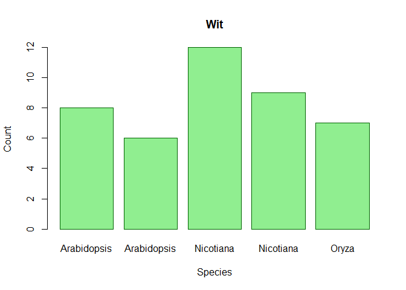

basic r
================
2025-05-02

``` r
plant_height <- 10.5
leaf_count <- 25

# print the values
plant_height
```

    ## [1] 10.5

``` r
## (1) 10.5
```

``` r
leaf_count
```

    ## [1] 25

``` r
plant_height <- plant_height + 2 
plant_height
```

    ## [1] 12.5

``` r
plant_height <- c(10.5, 20.5, 12.5, 8.5)
plant_height + 10
```

    ## [1] 20.5 30.5 22.5 18.5

``` r
plant_height + leaf_count
```

    ## [1] 35.5 45.5 37.5 33.5

``` r
weight <- 2.5
class(weight)
```

    ## [1] "numeric"

``` r
class(plant_height)
```

    ## [1] "numeric"

``` r
class(leaf_count)
```

    ## [1] "numeric"

``` r
count <- 10L
class(count)
```

    ## [1] "integer"

``` r
count+10
```

    ## [1] 20

``` r
count <- "10L"
count
```

    ## [1] "10L"

``` r
class(count)
```

    ## [1] "character"

``` r
is_flower <- "TRUE"
class(is_flower)
```

    ## [1] "character"

``` r
treatments <- factor(c("Control", "Teatment A", "Treatment B", "Control", "Treatment A"))
```

``` r
treatments <- factor(c("Control", "Teatment A", "Treatment B", "Control", "Treatment A"))
```

``` r
treatments
```

    ## [1] Control     Teatment A  Treatment B Control     Treatment A
    ## Levels: Control Teatment A Treatment A Treatment B

``` r
levels(treatments)
```

    ## [1] "Control"     "Teatment A"  "Treatment A" "Treatment B"

``` r
table(treatments)
```

    ## treatments
    ##     Control  Teatment A Treatment A Treatment B 
    ##           2           1           1           1

``` r
experiment <- data.frame(
  Plant_ID = 1:5,
  Species = c("Arabidopsis", "Arabidopsis", "Nicotiana", "Nicotiana", "Oryza"),
  Treatment = c("Control", "Drought", "Control", "Drought", "Control"),
  Height = c(10.2, 8.7, 15.3, 12.8, 25.4),
  Leaf_Count = c(8, 6, 12, 9, 7)
)
```

``` r
table(experiment)
```

    ## , , Treatment = Control, Height = 8.7, Leaf_Count = 6
    ## 
    ##         Species
    ## Plant_ID Arabidopsis Nicotiana Oryza
    ##        1           0         0     0
    ##        2           0         0     0
    ##        3           0         0     0
    ##        4           0         0     0
    ##        5           0         0     0
    ## 
    ## , , Treatment = Drought, Height = 8.7, Leaf_Count = 6
    ## 
    ##         Species
    ## Plant_ID Arabidopsis Nicotiana Oryza
    ##        1           0         0     0
    ##        2           1         0     0
    ##        3           0         0     0
    ##        4           0         0     0
    ##        5           0         0     0
    ## 
    ## , , Treatment = Control, Height = 10.2, Leaf_Count = 6
    ## 
    ##         Species
    ## Plant_ID Arabidopsis Nicotiana Oryza
    ##        1           0         0     0
    ##        2           0         0     0
    ##        3           0         0     0
    ##        4           0         0     0
    ##        5           0         0     0
    ## 
    ## , , Treatment = Drought, Height = 10.2, Leaf_Count = 6
    ## 
    ##         Species
    ## Plant_ID Arabidopsis Nicotiana Oryza
    ##        1           0         0     0
    ##        2           0         0     0
    ##        3           0         0     0
    ##        4           0         0     0
    ##        5           0         0     0
    ## 
    ## , , Treatment = Control, Height = 12.8, Leaf_Count = 6
    ## 
    ##         Species
    ## Plant_ID Arabidopsis Nicotiana Oryza
    ##        1           0         0     0
    ##        2           0         0     0
    ##        3           0         0     0
    ##        4           0         0     0
    ##        5           0         0     0
    ## 
    ## , , Treatment = Drought, Height = 12.8, Leaf_Count = 6
    ## 
    ##         Species
    ## Plant_ID Arabidopsis Nicotiana Oryza
    ##        1           0         0     0
    ##        2           0         0     0
    ##        3           0         0     0
    ##        4           0         0     0
    ##        5           0         0     0
    ## 
    ## , , Treatment = Control, Height = 15.3, Leaf_Count = 6
    ## 
    ##         Species
    ## Plant_ID Arabidopsis Nicotiana Oryza
    ##        1           0         0     0
    ##        2           0         0     0
    ##        3           0         0     0
    ##        4           0         0     0
    ##        5           0         0     0
    ## 
    ## , , Treatment = Drought, Height = 15.3, Leaf_Count = 6
    ## 
    ##         Species
    ## Plant_ID Arabidopsis Nicotiana Oryza
    ##        1           0         0     0
    ##        2           0         0     0
    ##        3           0         0     0
    ##        4           0         0     0
    ##        5           0         0     0
    ## 
    ## , , Treatment = Control, Height = 25.4, Leaf_Count = 6
    ## 
    ##         Species
    ## Plant_ID Arabidopsis Nicotiana Oryza
    ##        1           0         0     0
    ##        2           0         0     0
    ##        3           0         0     0
    ##        4           0         0     0
    ##        5           0         0     0
    ## 
    ## , , Treatment = Drought, Height = 25.4, Leaf_Count = 6
    ## 
    ##         Species
    ## Plant_ID Arabidopsis Nicotiana Oryza
    ##        1           0         0     0
    ##        2           0         0     0
    ##        3           0         0     0
    ##        4           0         0     0
    ##        5           0         0     0
    ## 
    ## , , Treatment = Control, Height = 8.7, Leaf_Count = 7
    ## 
    ##         Species
    ## Plant_ID Arabidopsis Nicotiana Oryza
    ##        1           0         0     0
    ##        2           0         0     0
    ##        3           0         0     0
    ##        4           0         0     0
    ##        5           0         0     0
    ## 
    ## , , Treatment = Drought, Height = 8.7, Leaf_Count = 7
    ## 
    ##         Species
    ## Plant_ID Arabidopsis Nicotiana Oryza
    ##        1           0         0     0
    ##        2           0         0     0
    ##        3           0         0     0
    ##        4           0         0     0
    ##        5           0         0     0
    ## 
    ## , , Treatment = Control, Height = 10.2, Leaf_Count = 7
    ## 
    ##         Species
    ## Plant_ID Arabidopsis Nicotiana Oryza
    ##        1           0         0     0
    ##        2           0         0     0
    ##        3           0         0     0
    ##        4           0         0     0
    ##        5           0         0     0
    ## 
    ## , , Treatment = Drought, Height = 10.2, Leaf_Count = 7
    ## 
    ##         Species
    ## Plant_ID Arabidopsis Nicotiana Oryza
    ##        1           0         0     0
    ##        2           0         0     0
    ##        3           0         0     0
    ##        4           0         0     0
    ##        5           0         0     0
    ## 
    ## , , Treatment = Control, Height = 12.8, Leaf_Count = 7
    ## 
    ##         Species
    ## Plant_ID Arabidopsis Nicotiana Oryza
    ##        1           0         0     0
    ##        2           0         0     0
    ##        3           0         0     0
    ##        4           0         0     0
    ##        5           0         0     0
    ## 
    ## , , Treatment = Drought, Height = 12.8, Leaf_Count = 7
    ## 
    ##         Species
    ## Plant_ID Arabidopsis Nicotiana Oryza
    ##        1           0         0     0
    ##        2           0         0     0
    ##        3           0         0     0
    ##        4           0         0     0
    ##        5           0         0     0
    ## 
    ## , , Treatment = Control, Height = 15.3, Leaf_Count = 7
    ## 
    ##         Species
    ## Plant_ID Arabidopsis Nicotiana Oryza
    ##        1           0         0     0
    ##        2           0         0     0
    ##        3           0         0     0
    ##        4           0         0     0
    ##        5           0         0     0
    ## 
    ## , , Treatment = Drought, Height = 15.3, Leaf_Count = 7
    ## 
    ##         Species
    ## Plant_ID Arabidopsis Nicotiana Oryza
    ##        1           0         0     0
    ##        2           0         0     0
    ##        3           0         0     0
    ##        4           0         0     0
    ##        5           0         0     0
    ## 
    ## , , Treatment = Control, Height = 25.4, Leaf_Count = 7
    ## 
    ##         Species
    ## Plant_ID Arabidopsis Nicotiana Oryza
    ##        1           0         0     0
    ##        2           0         0     0
    ##        3           0         0     0
    ##        4           0         0     0
    ##        5           0         0     1
    ## 
    ## , , Treatment = Drought, Height = 25.4, Leaf_Count = 7
    ## 
    ##         Species
    ## Plant_ID Arabidopsis Nicotiana Oryza
    ##        1           0         0     0
    ##        2           0         0     0
    ##        3           0         0     0
    ##        4           0         0     0
    ##        5           0         0     0
    ## 
    ## , , Treatment = Control, Height = 8.7, Leaf_Count = 8
    ## 
    ##         Species
    ## Plant_ID Arabidopsis Nicotiana Oryza
    ##        1           0         0     0
    ##        2           0         0     0
    ##        3           0         0     0
    ##        4           0         0     0
    ##        5           0         0     0
    ## 
    ## , , Treatment = Drought, Height = 8.7, Leaf_Count = 8
    ## 
    ##         Species
    ## Plant_ID Arabidopsis Nicotiana Oryza
    ##        1           0         0     0
    ##        2           0         0     0
    ##        3           0         0     0
    ##        4           0         0     0
    ##        5           0         0     0
    ## 
    ## , , Treatment = Control, Height = 10.2, Leaf_Count = 8
    ## 
    ##         Species
    ## Plant_ID Arabidopsis Nicotiana Oryza
    ##        1           1         0     0
    ##        2           0         0     0
    ##        3           0         0     0
    ##        4           0         0     0
    ##        5           0         0     0
    ## 
    ## , , Treatment = Drought, Height = 10.2, Leaf_Count = 8
    ## 
    ##         Species
    ## Plant_ID Arabidopsis Nicotiana Oryza
    ##        1           0         0     0
    ##        2           0         0     0
    ##        3           0         0     0
    ##        4           0         0     0
    ##        5           0         0     0
    ## 
    ## , , Treatment = Control, Height = 12.8, Leaf_Count = 8
    ## 
    ##         Species
    ## Plant_ID Arabidopsis Nicotiana Oryza
    ##        1           0         0     0
    ##        2           0         0     0
    ##        3           0         0     0
    ##        4           0         0     0
    ##        5           0         0     0
    ## 
    ## , , Treatment = Drought, Height = 12.8, Leaf_Count = 8
    ## 
    ##         Species
    ## Plant_ID Arabidopsis Nicotiana Oryza
    ##        1           0         0     0
    ##        2           0         0     0
    ##        3           0         0     0
    ##        4           0         0     0
    ##        5           0         0     0
    ## 
    ## , , Treatment = Control, Height = 15.3, Leaf_Count = 8
    ## 
    ##         Species
    ## Plant_ID Arabidopsis Nicotiana Oryza
    ##        1           0         0     0
    ##        2           0         0     0
    ##        3           0         0     0
    ##        4           0         0     0
    ##        5           0         0     0
    ## 
    ## , , Treatment = Drought, Height = 15.3, Leaf_Count = 8
    ## 
    ##         Species
    ## Plant_ID Arabidopsis Nicotiana Oryza
    ##        1           0         0     0
    ##        2           0         0     0
    ##        3           0         0     0
    ##        4           0         0     0
    ##        5           0         0     0
    ## 
    ## , , Treatment = Control, Height = 25.4, Leaf_Count = 8
    ## 
    ##         Species
    ## Plant_ID Arabidopsis Nicotiana Oryza
    ##        1           0         0     0
    ##        2           0         0     0
    ##        3           0         0     0
    ##        4           0         0     0
    ##        5           0         0     0
    ## 
    ## , , Treatment = Drought, Height = 25.4, Leaf_Count = 8
    ## 
    ##         Species
    ## Plant_ID Arabidopsis Nicotiana Oryza
    ##        1           0         0     0
    ##        2           0         0     0
    ##        3           0         0     0
    ##        4           0         0     0
    ##        5           0         0     0
    ## 
    ## , , Treatment = Control, Height = 8.7, Leaf_Count = 9
    ## 
    ##         Species
    ## Plant_ID Arabidopsis Nicotiana Oryza
    ##        1           0         0     0
    ##        2           0         0     0
    ##        3           0         0     0
    ##        4           0         0     0
    ##        5           0         0     0
    ## 
    ## , , Treatment = Drought, Height = 8.7, Leaf_Count = 9
    ## 
    ##         Species
    ## Plant_ID Arabidopsis Nicotiana Oryza
    ##        1           0         0     0
    ##        2           0         0     0
    ##        3           0         0     0
    ##        4           0         0     0
    ##        5           0         0     0
    ## 
    ## , , Treatment = Control, Height = 10.2, Leaf_Count = 9
    ## 
    ##         Species
    ## Plant_ID Arabidopsis Nicotiana Oryza
    ##        1           0         0     0
    ##        2           0         0     0
    ##        3           0         0     0
    ##        4           0         0     0
    ##        5           0         0     0
    ## 
    ## , , Treatment = Drought, Height = 10.2, Leaf_Count = 9
    ## 
    ##         Species
    ## Plant_ID Arabidopsis Nicotiana Oryza
    ##        1           0         0     0
    ##        2           0         0     0
    ##        3           0         0     0
    ##        4           0         0     0
    ##        5           0         0     0
    ## 
    ## , , Treatment = Control, Height = 12.8, Leaf_Count = 9
    ## 
    ##         Species
    ## Plant_ID Arabidopsis Nicotiana Oryza
    ##        1           0         0     0
    ##        2           0         0     0
    ##        3           0         0     0
    ##        4           0         0     0
    ##        5           0         0     0
    ## 
    ## , , Treatment = Drought, Height = 12.8, Leaf_Count = 9
    ## 
    ##         Species
    ## Plant_ID Arabidopsis Nicotiana Oryza
    ##        1           0         0     0
    ##        2           0         0     0
    ##        3           0         0     0
    ##        4           0         1     0
    ##        5           0         0     0
    ## 
    ## , , Treatment = Control, Height = 15.3, Leaf_Count = 9
    ## 
    ##         Species
    ## Plant_ID Arabidopsis Nicotiana Oryza
    ##        1           0         0     0
    ##        2           0         0     0
    ##        3           0         0     0
    ##        4           0         0     0
    ##        5           0         0     0
    ## 
    ## , , Treatment = Drought, Height = 15.3, Leaf_Count = 9
    ## 
    ##         Species
    ## Plant_ID Arabidopsis Nicotiana Oryza
    ##        1           0         0     0
    ##        2           0         0     0
    ##        3           0         0     0
    ##        4           0         0     0
    ##        5           0         0     0
    ## 
    ## , , Treatment = Control, Height = 25.4, Leaf_Count = 9
    ## 
    ##         Species
    ## Plant_ID Arabidopsis Nicotiana Oryza
    ##        1           0         0     0
    ##        2           0         0     0
    ##        3           0         0     0
    ##        4           0         0     0
    ##        5           0         0     0
    ## 
    ## , , Treatment = Drought, Height = 25.4, Leaf_Count = 9
    ## 
    ##         Species
    ## Plant_ID Arabidopsis Nicotiana Oryza
    ##        1           0         0     0
    ##        2           0         0     0
    ##        3           0         0     0
    ##        4           0         0     0
    ##        5           0         0     0
    ## 
    ## , , Treatment = Control, Height = 8.7, Leaf_Count = 12
    ## 
    ##         Species
    ## Plant_ID Arabidopsis Nicotiana Oryza
    ##        1           0         0     0
    ##        2           0         0     0
    ##        3           0         0     0
    ##        4           0         0     0
    ##        5           0         0     0
    ## 
    ## , , Treatment = Drought, Height = 8.7, Leaf_Count = 12
    ## 
    ##         Species
    ## Plant_ID Arabidopsis Nicotiana Oryza
    ##        1           0         0     0
    ##        2           0         0     0
    ##        3           0         0     0
    ##        4           0         0     0
    ##        5           0         0     0
    ## 
    ## , , Treatment = Control, Height = 10.2, Leaf_Count = 12
    ## 
    ##         Species
    ## Plant_ID Arabidopsis Nicotiana Oryza
    ##        1           0         0     0
    ##        2           0         0     0
    ##        3           0         0     0
    ##        4           0         0     0
    ##        5           0         0     0
    ## 
    ## , , Treatment = Drought, Height = 10.2, Leaf_Count = 12
    ## 
    ##         Species
    ## Plant_ID Arabidopsis Nicotiana Oryza
    ##        1           0         0     0
    ##        2           0         0     0
    ##        3           0         0     0
    ##        4           0         0     0
    ##        5           0         0     0
    ## 
    ## , , Treatment = Control, Height = 12.8, Leaf_Count = 12
    ## 
    ##         Species
    ## Plant_ID Arabidopsis Nicotiana Oryza
    ##        1           0         0     0
    ##        2           0         0     0
    ##        3           0         0     0
    ##        4           0         0     0
    ##        5           0         0     0
    ## 
    ## , , Treatment = Drought, Height = 12.8, Leaf_Count = 12
    ## 
    ##         Species
    ## Plant_ID Arabidopsis Nicotiana Oryza
    ##        1           0         0     0
    ##        2           0         0     0
    ##        3           0         0     0
    ##        4           0         0     0
    ##        5           0         0     0
    ## 
    ## , , Treatment = Control, Height = 15.3, Leaf_Count = 12
    ## 
    ##         Species
    ## Plant_ID Arabidopsis Nicotiana Oryza
    ##        1           0         0     0
    ##        2           0         0     0
    ##        3           0         1     0
    ##        4           0         0     0
    ##        5           0         0     0
    ## 
    ## , , Treatment = Drought, Height = 15.3, Leaf_Count = 12
    ## 
    ##         Species
    ## Plant_ID Arabidopsis Nicotiana Oryza
    ##        1           0         0     0
    ##        2           0         0     0
    ##        3           0         0     0
    ##        4           0         0     0
    ##        5           0         0     0
    ## 
    ## , , Treatment = Control, Height = 25.4, Leaf_Count = 12
    ## 
    ##         Species
    ## Plant_ID Arabidopsis Nicotiana Oryza
    ##        1           0         0     0
    ##        2           0         0     0
    ##        3           0         0     0
    ##        4           0         0     0
    ##        5           0         0     0
    ## 
    ## , , Treatment = Drought, Height = 25.4, Leaf_Count = 12
    ## 
    ##         Species
    ## Plant_ID Arabidopsis Nicotiana Oryza
    ##        1           0         0     0
    ##        2           0         0     0
    ##        3           0         0     0
    ##        4           0         0     0
    ##        5           0         0     0

``` r
experiment
```

    ##   Plant_ID     Species Treatment Height Leaf_Count
    ## 1        1 Arabidopsis   Control   10.2          8
    ## 2        2 Arabidopsis   Drought    8.7          6
    ## 3        3   Nicotiana   Control   15.3         12
    ## 4        4   Nicotiana   Drought   12.8          9
    ## 5        5       Oryza   Control   25.4          7

``` r
experiment$Height
```

    ## [1] 10.2  8.7 15.3 12.8 25.4

``` r
summary(experiment)
```

    ##     Plant_ID   Species           Treatment             Height     
    ##  Min.   :1   Length:5           Length:5           Min.   : 8.70  
    ##  1st Qu.:2   Class :character   Class :character   1st Qu.:10.20  
    ##  Median :3   Mode  :character   Mode  :character   Median :12.80  
    ##  Mean   :3                                         Mean   :14.48  
    ##  3rd Qu.:4                                         3rd Qu.:15.30  
    ##  Max.   :5                                         Max.   :25.40  
    ##    Leaf_Count  
    ##  Min.   : 6.0  
    ##  1st Qu.: 7.0  
    ##  Median : 8.0  
    ##  Mean   : 8.4  
    ##  3rd Qu.: 9.0  
    ##  Max.   :12.0

``` r
experiment[2, 4]
```

    ## [1] 8.7

``` r
experiment[1:3, c("Species", "Height")]
```

    ##       Species Height
    ## 1 Arabidopsis   10.2
    ## 2 Arabidopsis    8.7
    ## 3   Nicotiana   15.3

``` r
plant_data <- list(
  id = "AT001",
  species = "Arabidopsis thaliana",
  heights = c(10.2, 11.5, 9.8),
  is_model_organism = TRUE,
  germination_rates = data.frame(
    temperature = c(20, 25, 30),
    rate = c(0.82, 0.95, 0.78)
  )
)
```

``` r
plant_data$species
```

    ## [1] "Arabidopsis thaliana"

``` r
plant_data$heights [2]
```

    ## [1] 11.5

``` r
plant_data$germination_rates
```

    ##   temperature rate
    ## 1          20 0.82
    ## 2          25 0.95
    ## 3          30 0.78

``` r
# Create some data
plant_age <- c(5, 10, 15, 20, 25, 30)
plant_size <- c(3.2, 8.5, 13.7, 18.2, 21.5, 24.8)

# Create a basic scatter plot
plot(plant_age, plant_size, 
     main = "Plant Growth Over Time",
     xlab = "Age (days)",
     ylab = "Height (cm)",
     col = "darkgreen",
     pch = 16)  # pch controls the point shape
```

<!-- -->

``` r
plot(experiment$Height, experiment$Leaf_Count, 
     main = "Sorawit Anunak",
     xlab = "Height (cm)",
     ylab = "Number",
     col = "darkgreen",
     pch = 16)
```

<!-- -->

``` r
# Create data for a bar plot
#species_counts <- c(15, 23, 8, 12)
#species_names <- c("Arabidopsis", "Nicotiana", "Oryza", "Zea")

# Create a bar plot
barplot(experiment$Leaf_Count, 
        names.arg = experiment$Species,
        main = "Wit",
        xlab = "Species",
        ylab = "Count",
        col = "lightgreen",
        border = "darkgreen")
```

<!-- -->

``` r
tmp <- table(experiment$Species)
tmp
```

    ## 
    ## Arabidopsis   Nicotiana       Oryza 
    ##           2           2           1

``` r
# Create some data
treatment_A <- c(12.3, 14.5, 13.8, 15.2, 11.9, 13.7)
treatment_B <- c(15.8, 16.2, 14.9, 17.3, 16.5, 15.9)
treatment_C <- c(10.2, 11.5, 9.8, 10.5, 12.1, 11.3)

# Combine data for boxplot
all_data <- list(
  "Control" = treatment_A,
  "Fertilizer" = treatment_B,
  "Drought" = treatment_C
)
dat2 <- data.frame(Control = treatment_A, 
                 Fertilizer = treatment_B,
                 Drought = treatment_C)
# Create a boxplot
boxplot(all_data,
        main = "Plant Heights by Treatment",
        ylab = "Height (cm)",
        col = c("lightblue", "lightgreen", "salmon"))
```

<!-- -->

``` r
# Create two groups for comparison
#control <- c(5.2, 5.5, 5.0, 5.8, 5.3, 5.1, 5.6)
#treatment <- c(6.5, 6.2, 6.8, 6.1, 6.7, 6.3, 6.5)
dat2
```

    ##   Control Fertilizer Drought
    ## 1    12.3       15.8    10.2
    ## 2    14.5       16.2    11.5
    ## 3    13.8       14.9     9.8
    ## 4    15.2       17.3    10.5
    ## 5    11.9       16.5    12.1
    ## 6    13.7       15.9    11.3

``` r
# Perform a t-test
t_test_result <- t.test(dat2$Fertilizer, dat2$Control)

# View the result
t_test_result
```

    ## 
    ##  Welch Two Sample t-test
    ## 
    ## data:  dat2$Fertilizer and dat2$Control
    ## t = 4.1511, df = 8.4347, p-value = 0.002855
    ## alternative hypothesis: true difference in means is not equal to 0
    ## 95 percent confidence interval:
    ##  1.138545 3.928121
    ## sample estimates:
    ## mean of x mean of y 
    ##  16.10000  13.56667

``` r
plant_growth <- data.frame(
  Heigth = c(dat2$Control, dat2$Fertilizer, dat2$Drought),
  Treatment = factor(rep(c("Control", "Fertilizer", "Drought"), each = 6))
)
```

``` r
# Perform one-way ANOVA
anova_result <- aov(Heigth ~ Treatment, data = plant_growth)

# Summary of the ANOVA results
summary(anova_result)
```

    ##             Df Sum Sq Mean Sq F value   Pr(>F)    
    ## Treatment    2  81.14   40.57   40.59 8.87e-07 ***
    ## Residuals   15  14.99    1.00                     
    ## ---
    ## Signif. codes:  0 '***' 0.001 '**' 0.01 '*' 0.05 '.' 0.1 ' ' 1

``` r
# If the ANOVA is significant, perform post-hoc test to find which groups differ
# Tukey's Honest Significant Difference test
tukey_result <- TukeyHSD(anova_result)
tukey_result
```

    ##   Tukey multiple comparisons of means
    ##     95% family-wise confidence level
    ## 
    ## Fit: aov(formula = Heigth ~ Treatment, data = plant_growth)
    ## 
    ## $Treatment
    ##                         diff       lwr       upr     p adj
    ## Drought-Control    -2.666667 -4.165984 -1.167350 0.0009157
    ## Fertilizer-Control  2.533333  1.034016  4.032650 0.0014425
    ## Fertilizer-Drought  5.200000  3.700683  6.699317 0.0000006

``` r
# If the ANOVA is significant, perform post-hoc test to find which groups differ
# Tukey's Honest Significant Difference test
tukey_result <- TukeyHSD(anova_result)
tukey_result
```

    ##   Tukey multiple comparisons of means
    ##     95% family-wise confidence level
    ## 
    ## Fit: aov(formula = Heigth ~ Treatment, data = plant_growth)
    ## 
    ## $Treatment
    ##                         diff       lwr       upr     p adj
    ## Drought-Control    -2.666667 -4.165984 -1.167350 0.0009157
    ## Fertilizer-Control  2.533333  1.034016  4.032650 0.0014425
    ## Fertilizer-Drought  5.200000  3.700683  6.699317 0.0000006
